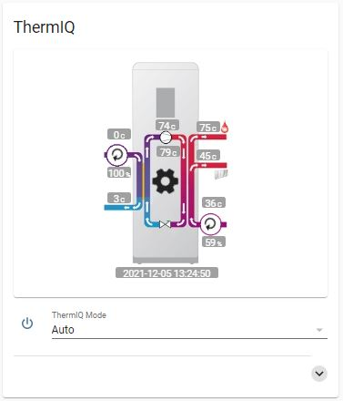
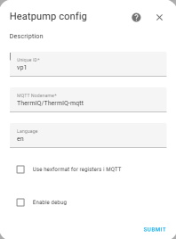

# Home Assistant ThermIQ-MQTT Integration
[](https://github.com/custom-components/hacs)


This integration allows you to use the ThermIQ-MQTT hardware interface to control and monitor your Thermia or Danfoss heatpump from Home Assistant. It is available as a default component of HACS, the Home Assistant Community Store.

Some background information on the ThermIQ-MQTT interface can be found here:
https://thermiq.net

**This integration will evolve over time**

Please note that updating from Release 1.x to Release 2.0 requires some significant changes in your configuration and you need to update/cleanup your setup accordingly.


## Requirements

- A running Mosquitto MQTT broker (server). If you have one already you can use it otherwise install Mosquitto broker from HA Add-On Store
- The HA MQTT Integration added in "Devices/Services" and properly configured for the above broker.
- ThermIQ-MQTT interface installed in your heatpump and properly configured to communicate over MQTT to the above broker
- A couple of HACS plugins

## Quick start
1. Make sure that ThermIQ is properly setup and communicating with the MQTT server. You should see MQTT messages in MQTT-Explorer from the heatpump every 30s
2. Make sure that MQTT Integration in Home Assistant is setup and communicating with the MQTT server
3. Make sure you have HACS set-up (https://github.com/custom-components/hacs).
4. Make sure you have installed the required HACS plugins
5. Go to the HACS integrations page, add ThermIQ integration and restart HA.
6. Go to Integrations and add ThermIQ.
-
        - The supplied Dashboard Card config assumes you are Using the default "Unique ID: vp1".
        - The MQTT Nodename should be given without a / in the end
        - Use hexformat only if you have ThermIQ-MQTT fw 1.xx
        - Use debug if you want to try it out without actually writing to the heatpump
7. Setup the Dashboard card to show what the heatpump is doing

## Configuration
#### Component Configuration in v2.x.x:
Component configuration is now done in the graphical interface

</br>

#### Automations configuration
No setup of automations is needed. You can use the normal "input_number" services to change a value in the heatpump.

```service: input_number.set_value
data: {"entity_id": "input_number.thermiq_mqtt_vp1_indoor_requested_t", "value":20}
```

#### Dashboard Configuration:
The Dashboard setup requires the following custom cards to be installed in HACS
```
- html-template-card from HTML Jinja2 Template card
- numberbox-card from Number Box
- fold-entity-row
```
 It is also necessary to move the three picture files below from github to be in the Dashboard path. They are currently coded to the **www/community/** directory (**local/community/**)
 ```
 vp_base.jpg
 vp_base_hgw_on.jpg
 vp_base_hw.jpg
 ```

The file [ThermIQ_Card.yaml](https://github.com/ThermIQ/thermiq_mqtt-ha/blob/master/ThermIQ_Card.yaml) contains a status view and a comprehensive set of variables. The can be added in the Dashboard editor. In HA do **“Edit Dashbord” - “+ Add Card” - "Manual"**, then copy and paste this **"Card file"**. This file assumes you used **vp1** as the **"Unique ID"** when setting up the integration. Please replace **_vp1** with **_yourid** if you customize your install or when adding more than one instance.

```yaml
# ################################################
# ##### ThermIQ Dashboard Card. Add by 
# "Edit Dashboard, + Add Card -> Manual" and paste this
# You might want to replace **"_vp1"** if you used a non-default **"Unique ID"** 

type: entities
title: ThermIQ_vp1
theme: default
show_header_toggle: false
entities:
  - type: custom:html-template-card
    title: null
    ignore_line_breaks: true
    content: >
 ...
 ...
 
```


#### Debugging
Make sure you see proper mqtt messages from the ThermIQ-MQTT in MQTT-Explorer before setting up HA
The Home Assistant server sometimes needs to be restarted once all configuration is done

I warmly recommend using [MQTT Explorer](https://mqtt-explorer.com/) for analysis of the MQTT setup.

## Register description
The naming, translation and grouping of registers can be improved, your input is appreciated. Most of it is in the [thermiq_regs.py](https://github.com/ThermIQ/thermiq_mqtt-ha/blob/master/custom_components/thermiq_mqtt/heatpump/thermiq_regs.py)  

A first attempt to create a description of the function behind each register can be found here
[REGISTERS.md](https://github.com/ThermIQ/thermiq_mqtt-ha/blob/master/REGISTERS.md)


## Features and Limitations
- Currently provides all data from the heatpump in the form of sensors and binary sensors
- Allows control over the heatpump 


## ThermIQ-USB Support
Tom R has created a Node-RED flow converting the previous version, ThermIQ-USB, to use the same MQTT messages making it compatible with this integration.
https://github.com/tomrosenback/thermiq-node-red-homeassistant-config

## Contributing
Contributions are welcome! If you'd like to contribute, feel free to pick up anything on the current [GitHub issues](https://github.com/ThermIQ/thermiq_mqtt-ha/issues) list!
All help improving the integration is appreciated!


